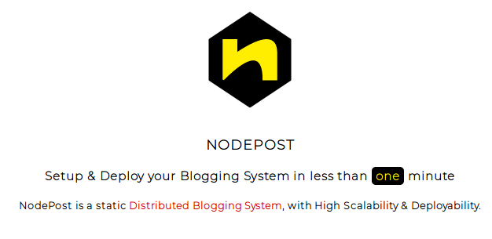
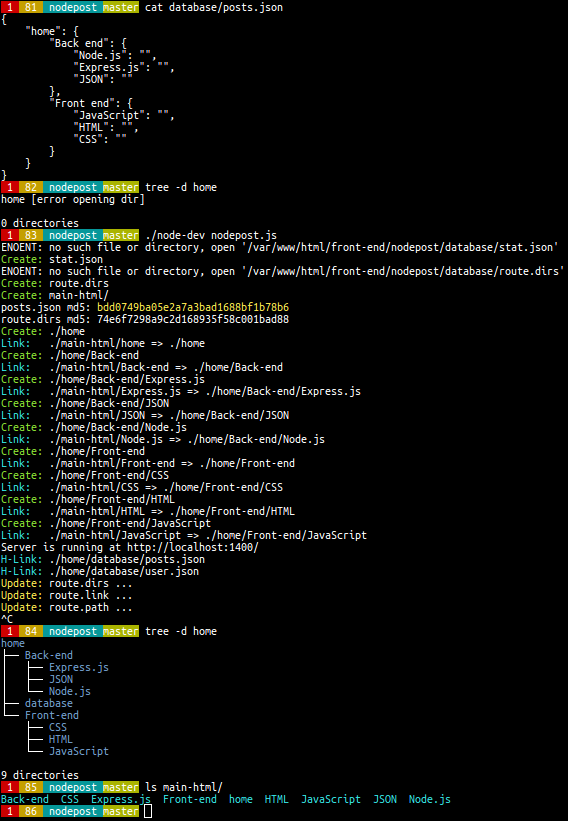

<p align="center">
	<a  href="http://nodepost.ir"></a>
</p>

<h1 align="center">Description</h1>

<h4>nodepost will turn a JSON file like this:</h4>

```javascript
{
    "home": {
        "effective-javascript": {
            "strict-mode": "",
            "implicit-coercion-explicit-coercion": "",
            "prefer-primitive-types": ""
        },
        "effective dom": "",
        "back-end with node.js": ""
    }
}
```

<h4>into a blog like this:</h4>
<h4>
    <a target="_blank" href="http://jsfun.ir">jsfun.ir</a>
</h4>

<h4>An image that is worth 1000 words!</h4>
<p align="center">
    
</p>

<h1 align="center">Strengths</h1>

 - Auto directory (=posts) management
 - Auto route management
 - Auto cache management
 - Auto Time Update
 - Auto "Edit on Github"
 - Easy Performance Test
 - Easy Statistics
 - Light weight
 - Unlimited nesting posts
 - As a microservice
 

 <h1 align="center">Weaknesses</h1>

  - Commenting

<h1 align="center">More</h1>

<a target="_blank" href="http://nodepost.ir">nodepost.ir</a>

<h1 align="center">License</h1>
<p id="bottom" align="center">
  nodepost copyright &copy; 20XX Shakiba Moshiri
  <br>
  <br>
  ▒█▀▄▀█ ▀█▀ ▀▀█▀▀<br>
  ▒█▒█▒█ ▒█░ ░▒█░░<br>
  ▒█░░▒█ ▄█▄ ░▒█░░<br>
</p>
